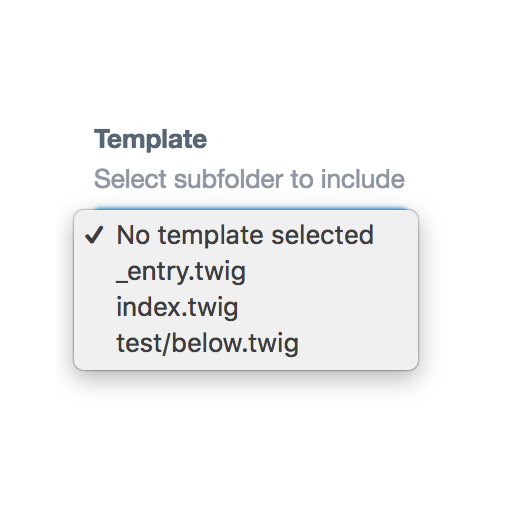
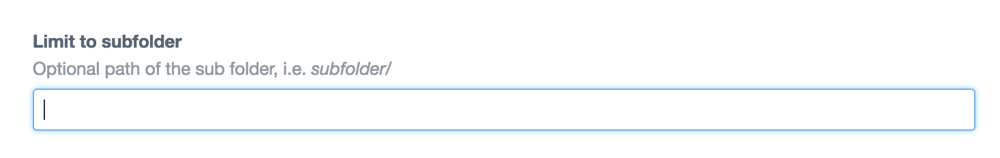

# Template Select plugin for Craft CMS 3.x

A fieldtype that allows you to select a template from the site templates folder.



## Requirements

This plugin requires Craft CMS 3.0.0-beta.23 or later.

## Installation

To install the plugin, follow these instructions.

1. Open your terminal and go to your Craft project:

        cd /path/to/project

2. Then tell Composer to load the plugin:

        composer require superbig/template-select

3. In the Control Panel, go to Settings → Plugins and click the “Install” button for Template Select.

## Configuring Template Select

You may limit the template list to a subfolder of the site template folder.

The path is relative, i.e. _subfolder/subfolder2/_.



## Using Template Select

If you want to include a template, you may do it like this in your entry template:

```twig

```

Brought to you by [Superbig](https://superbig.co)
