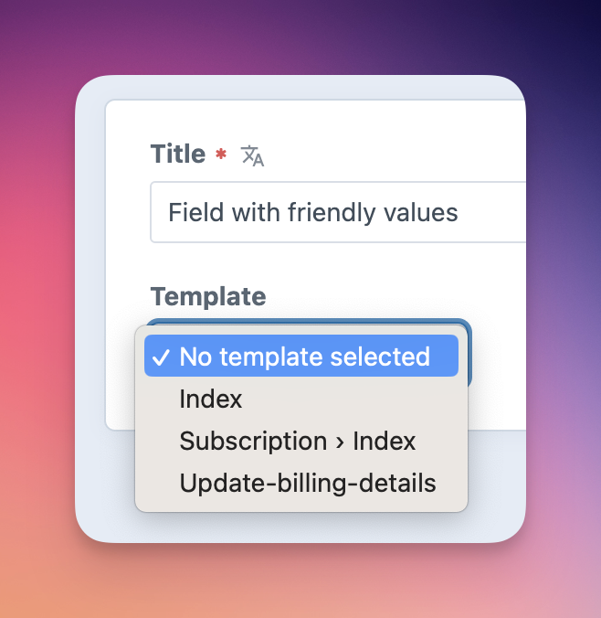
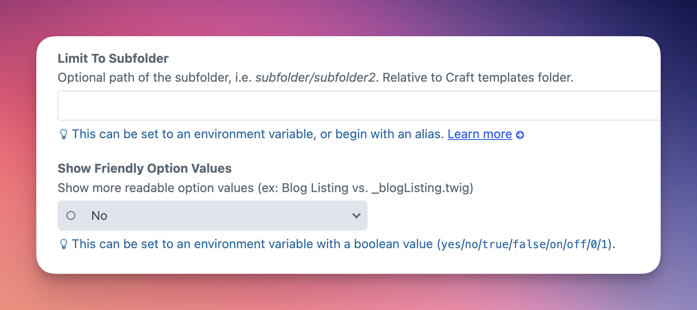
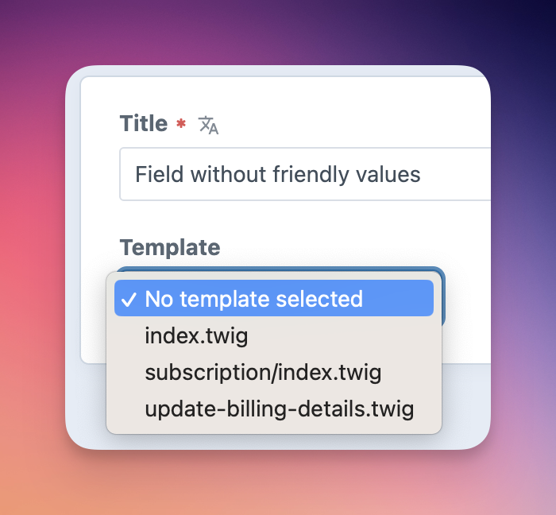

# Template Select plugin for Craft CMS

A fieldtype that allows you to select a template from the site templates folder.



## Requirements

This plugin requires Craft CMS 4.0 or later.

## Installation

To install the plugin, follow these instructions.

1. Open your terminal and go to your Craft project:

        cd /path/to/project

2. Then tell Composer to load the plugin:

        composer require superbig/craft3-templateselect

3. In the Control Panel, go to Settings → Plugins and click the “Install” button for Template Select.

## Configuring Template Select

Create a new field and choose field type Template Select.

In the field settings, you can limit the list of available templates to a subfolder of the Craft templates folder. The path is relative, i.e. _subfolder/anotherfolder_. This may also be set to an ENV variable.





In the field settings, you can choose to make the template names more user friendly. In the field, the list will be improved by changing the following:
- file extensions will be removed
- the file names will be capitalized and spaced for readability
- folders will be separated by ›


## Using Template Select

### Output the chosen template name:

```twig
{{ entry.fieldHandle }}
```

### Include/Embed the chosen template:

```twig

```

### Include the template including subfolder if set:

```twig

```

This is a alias for the following:

```twig
{{ entry.fieldHandle.template(true) }}
```

### Output the subfolder name:

```twig
{{ entry.fieldHandle.subfolder() }}
```

### Output the filename without path:

```twig
{{ entry.fieldHandle.filename() }}
```

Brought to you by [Superbig](https://superbig.co)
