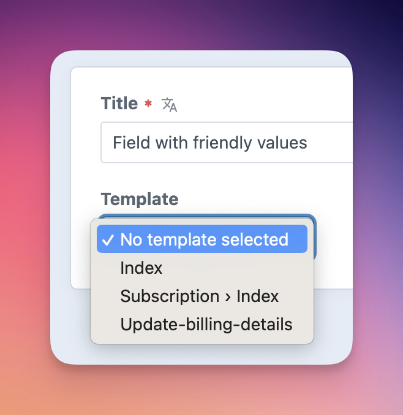
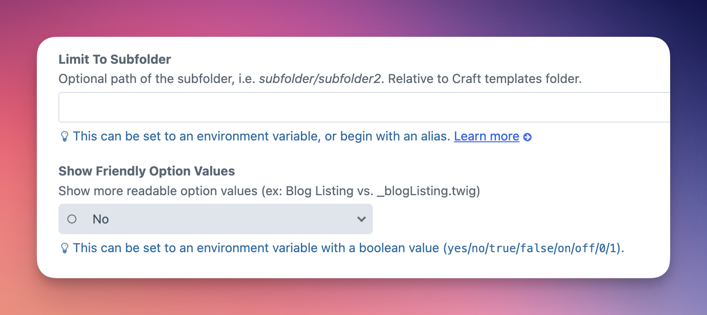
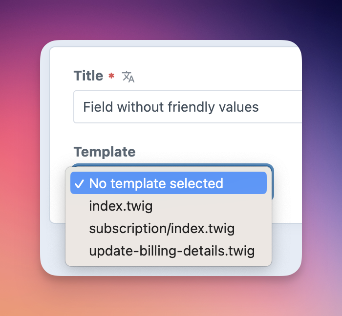

# Template Select plugin for Craft CMS

A fieldtype that allows you to select a template from the site templates folder.



## Requirements

This plugin requires Craft CMS 4.0 or later.

## Installation

To install the plugin, follow these instructions.

1. Open your terminal and go to your Craft project:

        cd /path/to/project

2. Then tell Composer to load the plugin:

        composer require superbig/craft3-templateselect

3. In the Control Panel, go to Settings → Plugins and click the “Install” button for Template Select.

## Configuring Template Select

Create a new field and choose field type Template Select.

In the field settings, you can limit the list of available templates to a subfolder of the Craft templates folder. The path is relative, i.e. _subfolder/anotherfolder_. This may also be set to an ENV variable.





In the field settings, you can choose to make the template names more user friendly. In the field, the list will be improved by changing the following:
- file extensions will be removed
- the file names will be capitalized and spaced for readability
- folders will be separated by ›


## Adding Descriptions to Templates

You can add descriptions to your templates to help users understand what each template does. This is especially useful when you have many templates to choose from.

To add a description to a template, add a special comment at the beginning of your template file:

```twig
{# @description: Displays a paginated list of blog posts with thumbnails and excerpts #}
```

The description will appear in the dropdown next to the template name, making it easier for content editors to select the right template.

**Examples:**

```twig
{# @description: Contact form with validation and CAPTCHA support #}
<form method="post">
    ...
</form>
```

```twig
{# @description: Hero section with background image and call-to-action button #}
<section class="hero">
    ...
</section>
```

Descriptions can also span multiple lines:

```twig
{# @description: Complex product grid layout
   Includes filters, sorting, and pagination
   Supports up to 4 columns #}
```

**Note:** Templates without descriptions will still work normally and appear in the dropdown without any description text.

## Using Template Select

### Output the chosen template name:

```twig
{{ entry.fieldHandle }}
```

### Include/Embed the chosen template:

```twig

```

### Include the template including subfolder if set:

```twig

```

This is a alias for the following:

```twig
{{ entry.templateWithSubfolder.template(true) }}
```

### Output the subfolder name:

```twig
{{ entry.fieldHandle.subfolder() }}
```

### Output the filename without path:

```twig
{{ entry.fieldHandle.filename() }}
```

Brought to you by [Superbig](https://superbig.co)
